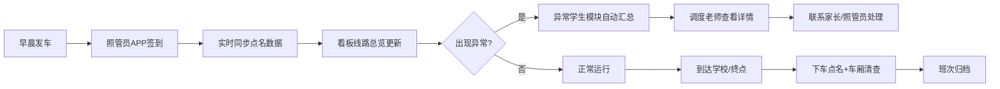

## 1. 产品概述

校车安全调度看板，为学校调度老师和值班校领导提供实时、集中的校车点名进度监控。替代传统逐车电话询问模式，让值班室在十几分钟内快速判断哪辆车、哪个孩子需要立即跟进。

- 核心用户：校车调度老师、值班校领导、安全管理岗位人员
- 核心价值：集中化监控、异常即时预警、班次可追溯

---

## 2. 核心功能

### 2.1 用户角色

| 角色 | 登录方式 | 核心权限 |
|------|----------|----------|
| 调度老师 | 工号登录 | 查看所有线路、异常学生处理、班次归档查看 |
| 值班校领导 | 工号登录 | 全局总览、历史数据查询、异常督办 |

### 2.2 功能模块

1. **线路总览**：实时展示各线路运行状态、乘车人数统计
2. **异常学生**：自动汇总未到、错站、临时接走等异常情况
3. **班次归档**：历史班次记录、下车点名和车厢清查确认

### 2.3 页面详情

| 页面名称 | 模块名称 | 功能描述 |
|----------|----------|----------|
| 调度看板首页 | 线路总览 | 卡片式展示每条线路的应乘人数、已上车人数、未确认人数、最后更新时间，颜色区分正常/延迟/异常状态 |
| 调度看板首页 | 异常学生 | 列表展示异常学生详情，包括所属班级、站点、照管员备注、建议联系对象，支持一键拨打 |
| 调度看板首页 | 班次归档 | 时间线展示历史班次，每班次显示下车点名完成状态、车厢清查状态、异常记录 |
| 调度看板首页 | 顶部状态栏 | 显示当前日期时间、值班人员、异常总数、运行中车辆数、已完成班次 |

---

## 3. 核心流程

---

## 4. 用户界面设计

### 4.1 设计风格

- **主色调**：深蓝色 `#1E3A5F`（代表专业、安全、可信赖）
- **辅助色**：
  - 正常状态：绿色 `#10B981`
  - 延迟状态：橙色 `#F59E0B`
  - 异常状态：红色 `#EF4444`
  - 信息提示：蓝色 `#3B82F6`
- **背景**：深灰蓝渐变 `#0F172A` → `#1E293B`，营造专业监控氛围
- **字体**：
  - 标题：`Noto Sans SC` 700 粗体，醒目有力
  - 正文：`Noto Sans SC` 400/500，清晰易读
  - 数字：`JetBrains Mono`，等宽字体便于数据比对
- **布局**：三栏式栅格布局，左侧线路总览、右侧上半异常学生、右侧下半班次归档
- **卡片风格**：圆角 12px，微阴影，边框线细腻，悬停时有轻微上浮动效
- **图标风格**：线性图标 `Lucide React`，统一 20px 尺寸

### 4.2 页面设计概述

| 页面名称 | 模块名称 | UI 元素 |
|----------|----------|----------|
| 调度看板 | 顶部状态栏 | 深色背景，大字号当前时间，值班人员信息，关键指标徽章（异常数、运行中、已完成） |
| 调度看板 | 线路总览 | 网格卡片，每卡片包含线路编号、司机/照管员、应乘/已乘/未确认数字，状态色条，实时更新倒计时 |
| 调度看板 | 异常学生 | 列表项带优先级标识，红色高亮紧急异常，展开可查看详情和联系按钮 |
| 调度看板 | 班次归档 | 时间线布局，每班条目带完成状态勾选，异常标记，点击展开详情 |

### 4.3 响应式设计

- **桌面优先**：1920px 基准，三栏布局
- **平板**：1024px 断点，改为上下两栏（线路总览在上，异常+归档在下）
- **关键数据优先**：缩小屏幕时优先保证数字和状态标识的可读性

### 4.4 动效设计

- 页面加载：卡片依次淡入上移（stagger 动画）
- 数据更新：数字变化时平滑过渡动画
- 异常出现：红色脉冲提示，闪烁 3 次后稳定
- 卡片悬停：轻微上浮（translateY -4px），阴影加深
- 状态变化：颜色渐变过渡 300ms

---

## 5. 非功能需求

- **实时性**：模拟每 10 秒数据更新，展示动态效果
- **可读性**：关键数据字体不小于 18px，状态颜色区分度高
- **性能**：单页应用，无刷新交互
- **Mock 数据**：内置 8 条线路、5-8 个异常学生示例、3 班历史归档数据
