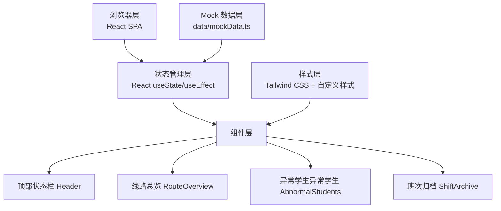
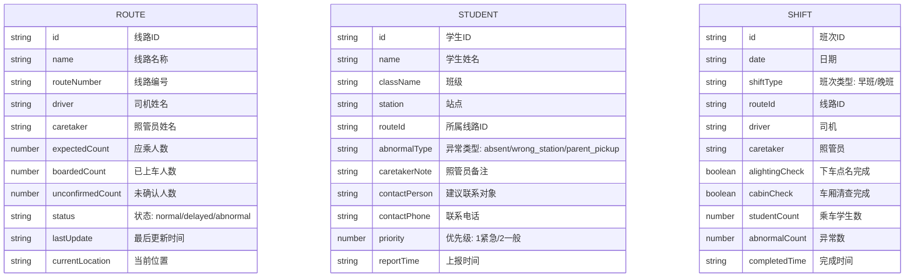

## 1. 架构设计



## 2. 技术描述

- **前端框架**：React@18 + TypeScript
- **构建工具**：Vite@5
- **样式方案**：Tailwind CSS@3 + CSS Variables
- **图标库**：Lucide React
- **字体**：Noto Sans SC（Google Fonts）+ JetBrains Mono
- **后端**：无（纯前端 Mock 数据）
- **数据库**：无（本地 Mock 数据）

### 项目结构

```
src/
├── components/
│   ├── Header.tsx           # 顶部状态栏
│   ├── RouteOverview.tsx    # 线路总览模块
│   ├── RouteCard.tsx        # 单条线路卡片
│   ├── AbnormalStudents.tsx # 异常学生模块
│   ├── StudentItem.tsx      # 单个学生条目
│   └── ShiftArchive.tsx     # 班次归档模块
├── data/
│   └── mockData.ts          # Mock 数据定义
├── types/
│   └── index.ts             # TypeScript 类型定义
├── App.tsx                  # 主应用组件
├── main.tsx                 # 入口文件
└── index.css                # 全局样式 + Tailwind
```

## 3. 路由定义

| 路由 | 用途 |
|------|------|
| / | 调度看板首页（单页应用，唯一主页面） |

## 4. 数据模型

### 4.1 数据模型定义



### 4.2 TypeScript 类型定义

```typescript
type RouteStatus = 'normal' | 'delayed' | 'abnormal';
type AbnormalType = 'absent' | 'wrong_station' | 'parent_pickup';
type ShiftType = 'morning' | 'afternoon';

interface Route {
  id: string;
  name: string;
  routeNumber: string;
  driver: string;
  caretaker: string;
  expectedCount: number;
  boardedCount: number;
  unconfirmedCount: number;
  status: RouteStatus;
  lastUpdate: string;
  currentLocation: string;
}

interface Student {
  id: string;
  name: string;
  className: string;
  station: string;
  routeId: string;
  abnormalType: AbnormalType;
  caretakerNote: string;
  contactPerson: string;
  contactPhone: string;
  priority: 1 | 2;
  reportTime: string;
}

interface Shift {
  id: string;
  date: string;
  shiftType: ShiftType;
  routeId: string;
  driver: string;
  caretaker: string;
  alightingCheck: boolean;
  cabinCheck: boolean;
  studentCount: number;
  abnormalCount: number;
  completedTime: string;
}

interface DashboardStats {
  totalRoutes: number;
  runningRoutes: number;
  completedRoutes: number;
  abnormalCount: number;
  currentTime: string;
  dutyOfficer: string;
}
```

## 5. 核心交互逻辑

### 5.1 实时数据更新
- 使用 `useEffect` + `setInterval` 每 10 秒模拟数据更新
- 随机调整各线路的 `boardedCount` 和 `unconfirmedCount`
- 偶尔触发新的异常学生上报

### 5.2 状态颜色映射
- `normal` → 绿色 `#10B981`
- `delayed` → 橙色 `#F59E0B`
- `abnormal` → 红色 `#EF4444`

### 5.3 异常类型文本映射
- `absent` → 未到
- `wrong_station` → 错站
- `parent_pickup` → 家长接走
